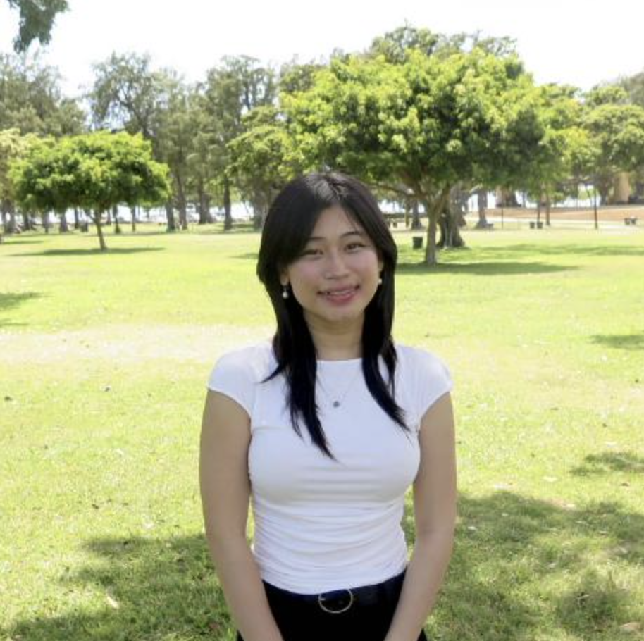
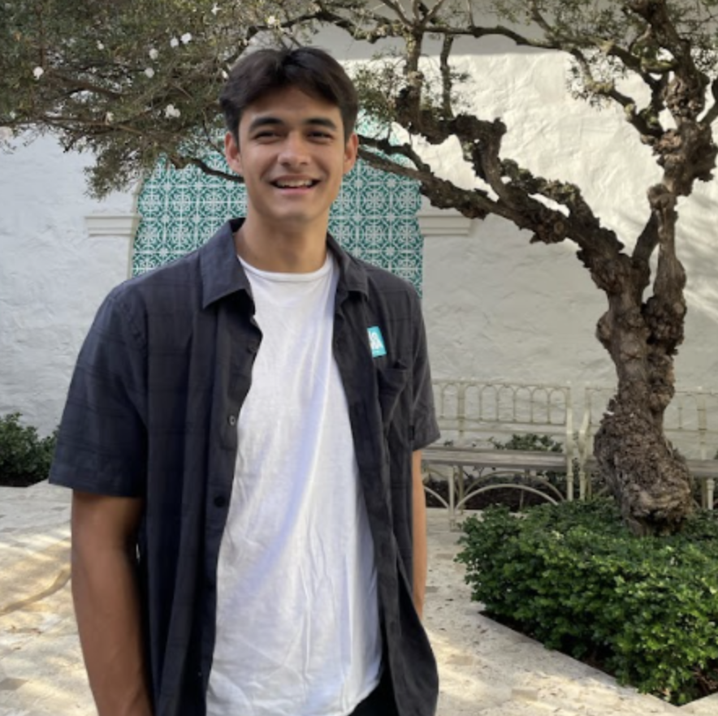
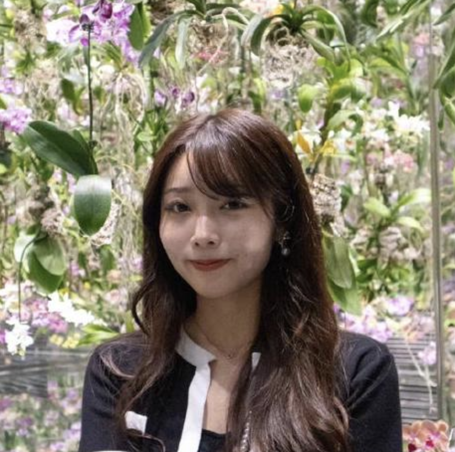

### About Team Members:
  

  

#### Salina Thongsisavath [[GitHub](https://github.com/salina-t) / [LinkedIn](https://www.linkedin.com/in/salinathongsisavath/)]

Salina Thongsisavath is studying for a B.S. in Computer Science in the Department of Information and Computer Sciences at the University of Hawai‘i at Mānoa and expects to graduate in Fall 2025. She hopes to pursue a career in Software Engineering.
  **Interests:** Software engineering, App development, Web development, UX/UI Design   

  

#### Ralph Ramos [[GitHub](https://github.com/ralphramosgit) / [LinkedIn](https://www.linkedin.com/in/ralph-jhon-ramos-8b7316242/)]

Ralph Ramos is studying for a B.S. in Computer Science in the Department of Information and Computer Sciences at the University of Hawai‘i and expects to graduate in Fall 2026.
  **Interests:** Software Development, Machine Learning, Computer Aided Design, Cloud Development, DevOps   

  

#### Joseph Heintz [[GitHub](https://github.com/josephheintz) / [LinkedIn](https://www.linkedin.com/in/joseph-heintz-49a45a28a/)]

Joseph Heintz is studying for a B.S. in Computer Science in the Department of Information and Computer Sciences at the University of Hawai‘i and expects to graduate in Spring 2025.
  **Interests:** Software Engineering, Video Games, Volleyball, Exercising   

  

#### Andrea Jans [[GitHub](https://github.com/awjans) / [LinkedIn](https://www.linkedin.com/in/andreawjans/)]

Andrea W. Jans is a Bachelor’s and Master’s (BAM) Computer Science student at the University of Hawai‘i at Mānoa, graduating with a Bachelor’s degree in Fall 2025 and a Master’s degree in Fall 2026. She is a results-oriented IT executive with extensive experience in systems integration, process control and improvement, and digital and business transformation. Andrea drives automation and continuous improvement through technological advancements to ensure compliance, governance, cybersecurity, and business continuity. She aligns technical solutions, business objectives, and teams to achieve operational excellence, scalable solutions, and efficiency, while also delivering expertise in technical support, software development, modeling, networking, and portfolio management.
  **Interests:** Automation, Machine Learning, Artificial Intelligence, Internationalization, System Administration   

  

#### Dominic Molina [[GitHub](https://github.com/dominic-isaac-molina) / [LinkedIn](https://www.linkedin.com/in/dominicisaacmolina/)]

Dominic Molina is studying for a B.S. in Computer Science in the Department of Information and Computer Sciences at the University of Hawai‘i.
  **Interests:** Web Development, Cybersecurity, Marketing, Data Analysis   

  

#### Dmitry Gordeev [[GitHub](https://github.com/GordeevD) / [LinkedIn](https://www.linkedin.com/in/gordeev-du/)]

Dmitry Gordeev is studying for a B.S. in Computer Science: General Track in the Department of Information and Computer Sciences at the University of Hawai‘i and expects to graduate in Fall 2026.
  **Interests:** AI, Computational Research, Quantum Computing, Robotics, Lasers   

  

#### Ellie Ishii [[GitHub](https://github.com/ellieishii) / [LinkedIn](https://www.linkedin.com/in/ellie-ishii-8a0043326/)]

Ellie Ishii is studying for a B.A. in Information and Computer Sciences at the University of Hawai‘i and expects to graduate in Spring 2026. She is currently working toward a career in Web Development.
  **Interests:** Web Development, Software Engineering, Web Application Development   

  

#### Joshua Sato [[GitHub](https://github.com/joshuanssato) / [LinkedIn](https://www.linkedin.com/in/joshua-ns-sato/)]

Joshua Sato is studying for a B.S. in Computer Science in the Department of Information and Computer Sciences at the University of Hawai‘i and expects to graduate in Fall 2025.
  **Interests:** Cyber Security, Game Development, Software Engineering, Data Mining, 3D Graphics   

  

#### Phoebe Chang [[GitHub](https://github.com/peachcrumb) / [LinkedIn](https://www.linkedin.com/in/phoebe-chang-0b995133b/)]

Phoebe Chang is studying for a B.S. in Computer Science in the Department of Information and Computer Sciences at the University of Hawai‘i and expects to graduate in Fall 2025.
  **Interests:** Web Design, Data Visualization, Neuroscience, Architecture
