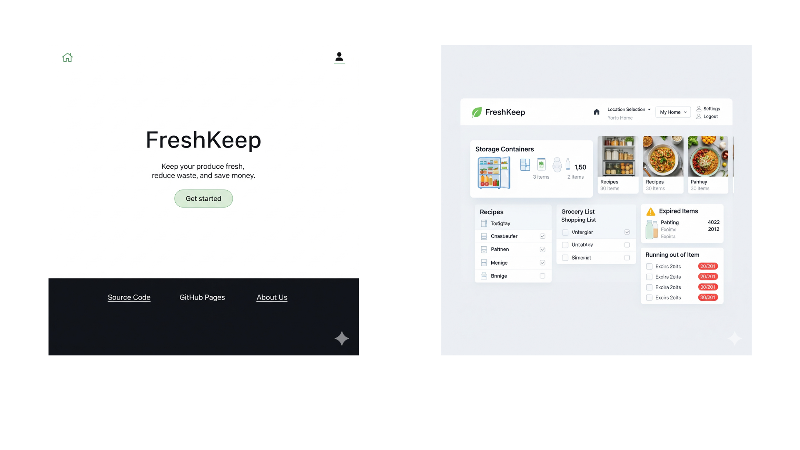
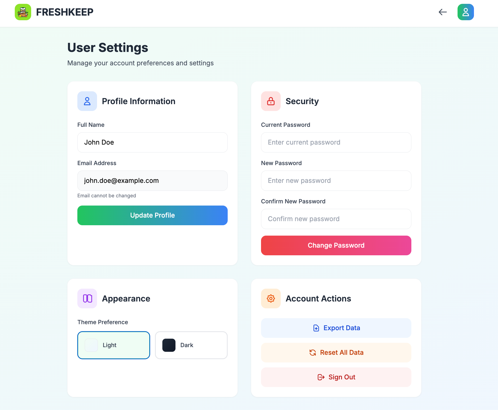

## University of Hawaiʻi at Mānoa - ICS 414 Project Team 3
Fall 2025

# [FreshKeep Application](https://freshkeepuh.live)

### Team
* [Salina Thongsisavath](https://salina-t.github.io)
* [Ralph Ramos](https://ralphramosgit.github.io)
* [Joseph Heintz](https://josephheintz.github.io)
* [Andrea Jans](https://andrea.jans.org)
* [Dominic Molina](https://dominic-isaac-molina.github.io)
* [Dmitry Gordeev](https://GordeevD.github.io)
* [Ellie Ishii](https://ellieishii.github.io)
* [Joshua Sato](https://joshuanssato.github.io)
* [Phoebe Chang](https://peachcrumb.github.io/)

[Team Contract](team-contract.md) ([Drive](https://docs.google.com/document/d/1MzPJ1kjAmIT8tNyVSGnF2TwIqzhSKTbYdr_i4EYSRlU/edit?usp=sharing))

## [About Developers](about-developers.md)
Learn about our team members!

### Milestones
* [Milestone 1 (M1)](https://github.com/orgs/freshkeepuh/projects/7) - Tech Stack and Mockups
* [Milestone 2 (M2)](https://github.com/orgs/freshkeepuh/projects/9) - Pages and Acceptance Testing
* [Milestone 3 (M3)](https://github.com/orgs/freshkeepuh/projects/13) - More Pages and Acceptance Testing
* [Milestone 4 (M4)](https://github.com/orgs/freshkeepuh/projects/15) - More Pages and Acceptance Testing
* [Milestone 5 (M5)](https://github.com/orgs/freshkeepuh/projects/18) - More Pages and Acceptance Testing

## Pages

  
  
  
  
  
  
  
  

## Mockups

  
  
  
  
  
  
  
  
  
  
  <!-- WIP -->
  
  

## Goals of the project
We get it--Life gets busy. Many of us, students, professors, parents, and adults struggle with food waste. Most of the time, we just don't have the right tools that help us keep track of everything. 

Our goal is to create a web application that allows our users to track their food inventory, such as refrigerators, freezers, pantries, and spice racks, to prevent significant food waste. 

We offer management tools such as tracking item stock, storage type, expiration dates, etc.

## [User Guide](user-guide.md)

## [Developer Guide](dev-guide.md)
