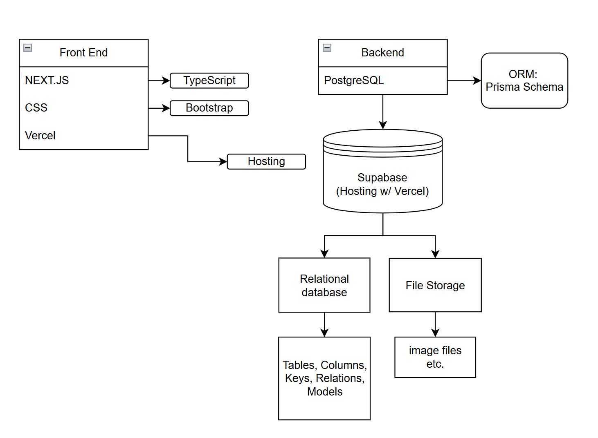

## UHM ICS 414 Project Team 4
Fall 2025

[Team Contract](team-contract.md) ([Drive](https://docs.google.com/document/d/1MzPJ1kjAmIT8tNyVSGnF2TwIqzhSKTbYdr_i4EYSRlU/edit?usp=sharing))

## Goals of the project
Create a web application that allows users to track their food inventory, manage expiration dates, etc.

## What the system should eventually provide

## Screenshots

## User Guide

## [Developers Guide](dev-guide.md)

## Draft Tech Stack Flowchart

## Draft Page Flowchart

