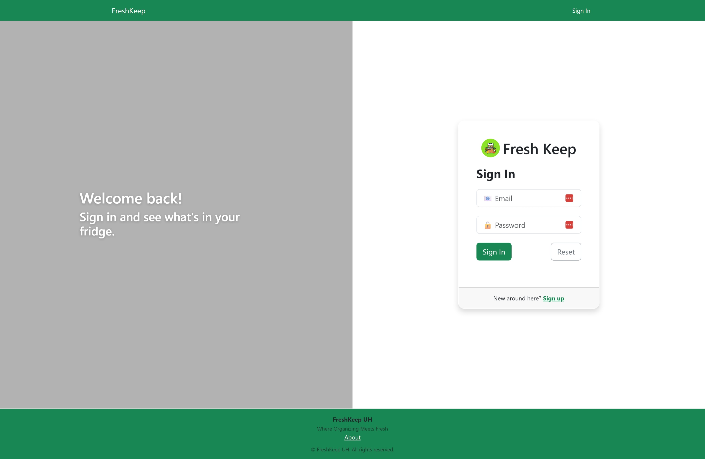
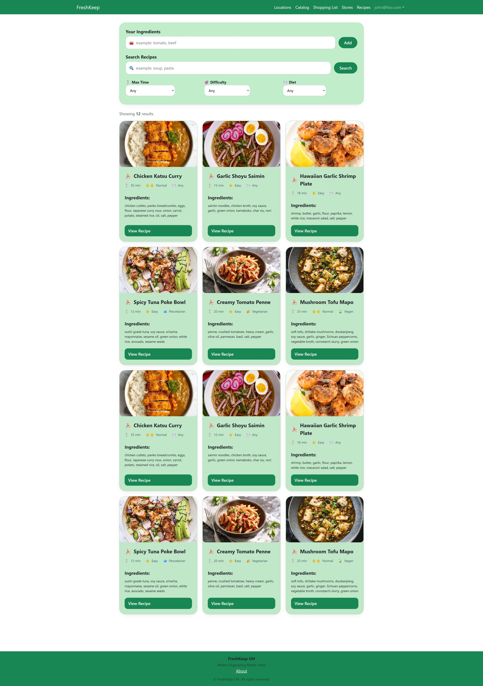
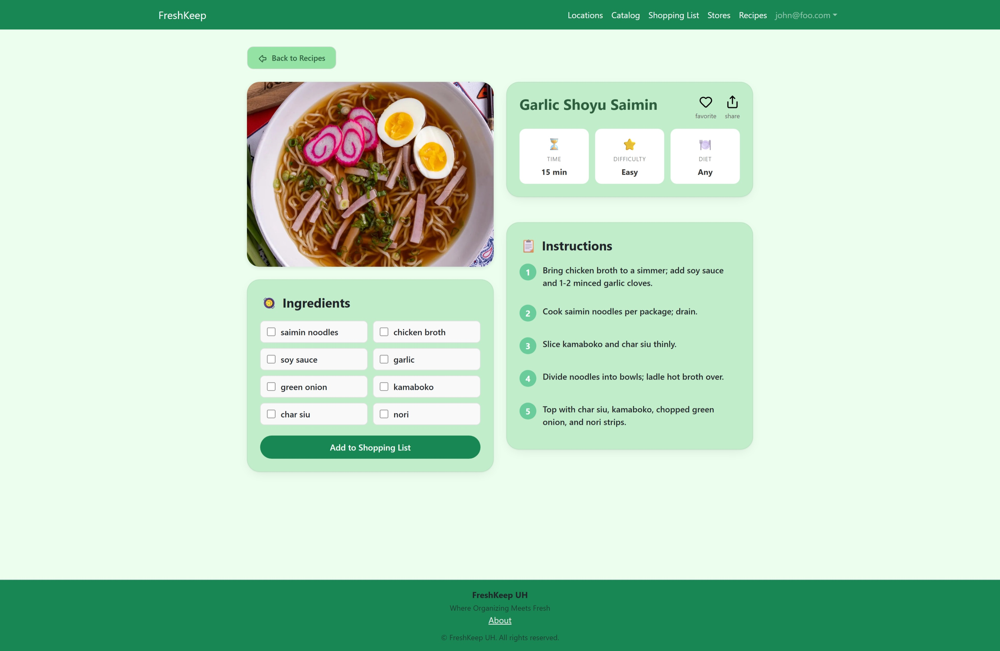

# How to Use FreshKeep

## Home Page

  

    The Home page is your landing page. It has a link in the upper right to sign in.
  

## Sign In

  

    The Sign In page is where you enter your credentials to access the FreshKeep application.
    Use your registered email address and password. If you do not have an account, the 'Sign Up' link will take you to the Sign Up page.
  

  

    
<strong>Fields</strong>

    <ul>
      <li><strong>Email:</strong> Enter your registered email address.</li>
      <li><strong>Password:</strong> Enter your password.</li>
    </ul>
    
<strong>Buttons</strong>

    <ul>
      <li><strong>Sign In:</strong> Sign In to FreshKeep.</li>
      <li><strong>Reset:</strong> Clear the form.</li>
    </ul>
    
<strong>Links</strong>

    <ul>
      <li><strong>Sign Up:</strong> Go to the Sign Up page.</li>
    </ul>
  

## Sign Up

  

    The Sign Up page is where you can create credentials to access the FreshKeep application.
    Use your primary email address. You will need to type a password longer than 6 characters and less than 20.
    You will need to confirm your password. If you email address is not already registered, your account will be created
    and you will be signed in.
    If you email address is already registered, you can use the 'Sign In' link to take you to the Sign In page.
  

  

    
<strong>Fields</strong>

    <ul>
      <li><strong>Email:</strong> Enter your email address.</li>
      <li><strong>Password:</strong> Enter your password.</li>
      <li><strong>Confirm Password:</strong> Enter your password again.</li>
    </ul>
    
<strong>Buttons</strong>

    <ul>
      <li><strong>Sign Up:</strong> Sign Up for FreshKeep.</li>
      <li><strong>Reset:</strong> Clear the form.</li>
    </ul>
    
<strong>Links</strong>

    <ul>
      <li><strong>Sign In:</strong> Go to the Sign In page.</li>
    </ul>
  

## Forgot Password

TBD

## Reset Password

TBD

## Dashboard

  

  The Dashboard page is your quick view of you inventory.

## Locations

  

  The Locations page is where you can manage your home and other locations where you live or work.

###  Location

  

  The Location page letes you see a single location and all of the storage associated with the location.

#### Add/Edit Mode

  

  The Add/Edit mode of the Location page allows you to edit the name, address, etc. of a new or existing location.

## Storages

  

  The Storages page is where you can manage all of your storage.

### Storage

  

  The Storage page letes you see a single storage and all of the product instances associated with it.

#### Add/Edit Mode

  

  The Add/Edit mode of the Storage page allows you to edit the name, type, etc. of a new or existing storage.

## Products

  

  The Products page is where you can manage all of your products.

### Product

  

  The Product page letes you see a single Product and all of the product instances associated with it.

#### Add/Edit Mode

  

  The Add/Edit mode of the Product page allows you to edit the name, type, etc. of a new or existing product.

#### Restock Mode

TBD

### Product Instance

  

  The Product Instance page allows you to see the instance of the product.

#### Add/Edit Mode

  

  The Add/Edit mode of the Product Instance page allows you to edit the location, storage, etc. of a new or existing product instance.

#### Use Mode

  

  The Use mode of the Product Instance page allows you to edit the Quantity of a new or existing product instance.

## Recipes

  

  The Recipe page allows you to see your recipes. Use the filter options to find a particular recipe.

### Recipe

  

  The Recipe page allows you to see the instance of the Recipe.

#### Add/Edit Mode

  

  The Add/Edit mode of the Recipe page allows you to edit the title, etc. of a new or existing recipe.

## Shopping Lists

  

    The Shopping Lists page allows you to see and manage your shopping lists.

### Shopping List

  

    The Shopping List page allows you to see the individual shoppiing list and the products associated with it.
  

#### Add/Edit Mode

  

  The Add/Edit mode of the Shopping List page allows you to edit the name, etc.

## Stores

  

  The Stores page allows you to see the stores at which you shop.

### Store

  

  The Store page allows you to see the particular store, the shopping lists associated with it, and the Products you purchase from that store.

#### Add/Edit Mode

  

  The Add/Edit mode of the Store page allows you to edit the name, address, etc.

## Settings

  

  The settings page allows you to customize your avatar, set your first and last name, update your email address, and select the light or dark theme

## Users

TBD

### User

TBD

#### Add/Edit Mode

TBD

## Reports

### Inventory

TBD

### Expired

TBD

### Expiring

TBD

### Restock

TBD