# How to Use FreshKeep

## Home Page

  
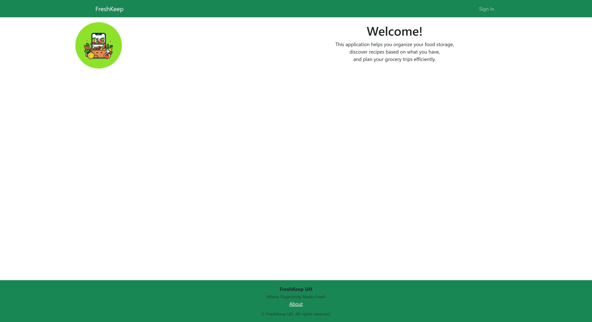
    The Home page is your landing page.
  

  

    
<strong>Links</strong>

    <ul>
      <li><strong>Sign In:</strong> Go to the <a href="#sign-in">Sign In</a> page.</li>
    </ul>
  

## Sign In

  

    The Sign In page is where you enter your credentials to access the FreshKeep application.
    Use your registered email address and password. If you do not have an account, use the '<a href="#sign-up">Sign Up</a>' link.
  

  

    
<strong>Fields</strong>

    <ul>
      <li><strong>Email:</strong> Enter your registered email address.</li>
      <li><strong>Password:</strong> Enter your password.</li>
      <li><strong>Remember Me:</strong> Check this to have the site remember your email address.</li>
    </ul>
    
<strong>Buttons</strong>

    <ul>
      <li><strong>Sign In:</strong> Sign In to FreshKeep.</li>
      <li><strong>Reset:</strong> Clear the form.</li>
    </ul>
    
<strong>Links</strong>

    <ul>
      <li><strong>Forgot Password:</strong> Go to the <a href="#forgot-password">Forgot Password</a> page.</li>
      <li><strong>Sign Up:</strong> Go to the <a href="#sign-up">Sign Up</a> page.</li>
    </ul>
  

## Sign Up

  
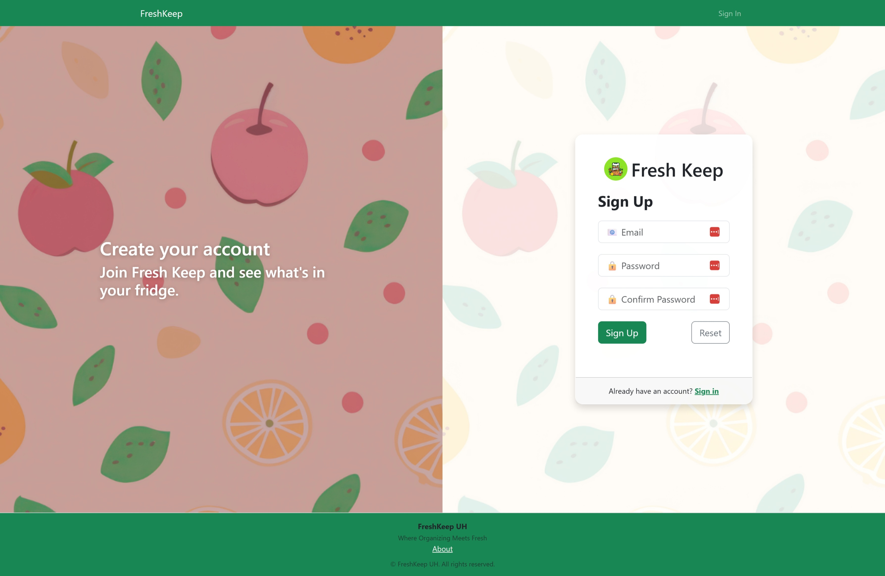
    The Sign Up page is where you can create credentials to access the FreshKeep application.
    Use your primary email address. You will need to type a password longer than 6 characters and less than 20.
    You will need to confirm your password. If your email address is not already registered, your account will be created
    and you will be signed in.
    If your email address is already registered, you can use the '<a href="#sign-in">Sign In</a>' link.
  

  

    
<strong>Fields</strong>

    <ul>
      <li><strong>Email:</strong> Enter your email address.</li>
      <li><strong>Password:</strong> Enter your password.</li>
      <li><strong>Confirm Password:</strong> Enter your password again.</li>
    </ul>
    
<strong>Buttons</strong>

    <ul>
      <li><strong>Sign Up:</strong> Sign Up for FreshKeep.</li>
      <li><strong>Reset:</strong> Clear the form.</li>
    </ul>
    
<strong>Links</strong>

    <ul>
      <li><strong>Sign In:</strong> Go to the <a href="#sign-in">Sign In</a> page.</li>
    </ul>
  

## Change Password

  
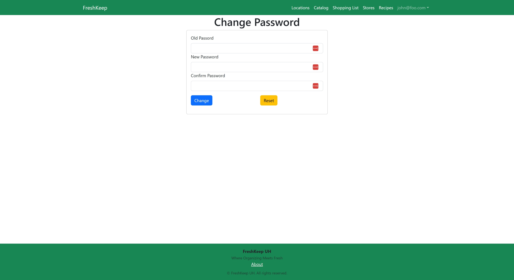
    The Change Password page is where you can change your password.
  

  

    
<strong>Fields</strong>

    <ul>
      <li><strong>Old Password:</strong> Enter your existing password.</li>
      <li><strong>New Password:</strong> Enter your new password.</li>
      <li><strong>Confirm New Password:</strong> Enter your new password again.</li>
    </ul>
    
<strong>Buttons</strong>

    <ul>
      <li><strong>Change:</strong> Change the password.</li>
      <li><strong>Reset:</strong> Clear the form.</li>
    </ul>
    
<strong>Links</strong>

    <ul>
      <li><strong>Forgot Password:</strong> Go to the <a href="#forgot-password">Forgot Password</a> page.</li>
    </ul>
  

## Forgot Password

  
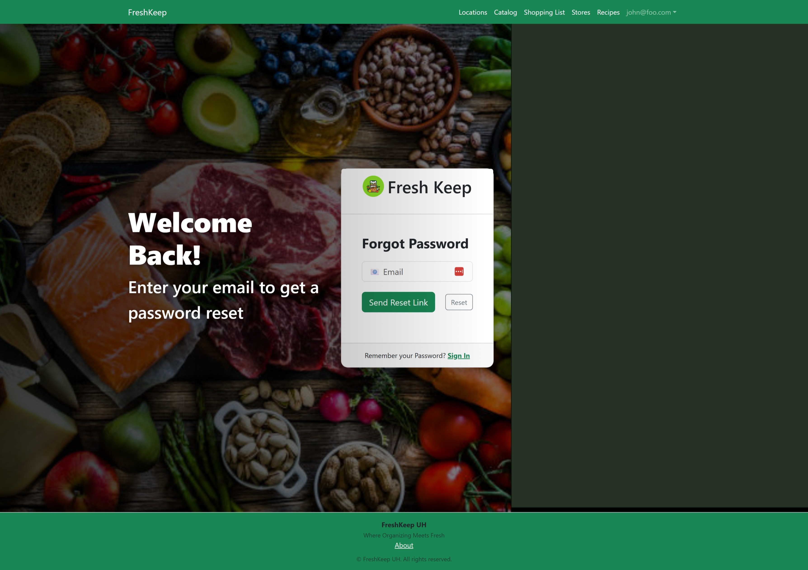
    The Forgot Password page is where you can enter your email address to get a Password Reset link.
  

  

    
<strong>Fields</strong>

    <ul>
      <li><strong>Email:</strong> Enter your email address.</li>
    </ul>
    
<strong>Buttons</strong>

    <ul>
      <li><strong>Send:</strong> Send the Password Reset email address if the email address exists.</li>
      <li><strong>Reset:</strong> Clear the form.</li>
    </ul>
    
<strong>Links</strong>

    <ul>
      <li><strong>Sign In:</strong> Go to the <a href="#sign-in">Sign In</a> page.</li>
      <li><strong>Sign Up:</strong> Go to the <a href="#sign-up">Sign Up</a> page.</li>
    </ul>
  

## Reset Password

  

    The Reset Password page is where you can reset your password if you forgot it.
  

  

    
<strong>Fields</strong>

    <ul>
      <li><strong>Password:</strong> Enter your new password.</li>
      <li><strong>Confirm Password:</strong> Enter your new password again.</li>
    </ul>
    
<strong>Buttons</strong>

    <ul>
      <li><strong>Update:</strong> Update your password.</li>
      <li><strong>Reset:</strong> Clear the form.</li>
    </ul>
    
<strong>Links</strong>

    <ul>
      <li><strong>Sign In:</strong> Go to the <a href="#sign-in">Sign In</a> page.</li>
      <li><strong>Sign Up:</strong> Go to the <a href="#sign-up">Sign Up</a> page.</li>
    </ul>
  

## Dashboard

  
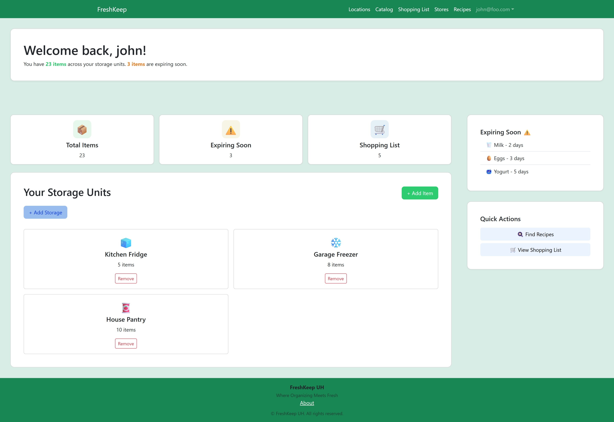
    The Dashboard page is your quick view of your inventory and gateway to all of the apps functions.
  

  

    
<strong>Components</strong>

    <ul>
      <li><strong>Total Items:</strong>
        Shows the total number of items in your inventory across all locations and storage areas.
        CLicking on Total Items will take you to the <a href="#inventory">Inventory</a> report.
      </li>
      <li><strong>Expired:</strong>
        Shows the number of items in your inventory that are expired.
        CLicking on Expired will take you to the <a href="#expired">Expired</a> report.
      </li>
      <li><strong>Shopping List:</strong>
        Shows the number of items on your default shopping list.
        Clicking on Shopping List will take you to the associated <a href="#shopping-list">Shopping List</a> page, where you can see all of the items on that Shopping List.
      </li>
      <li><strong>Storage Areas:</strong>
        Shows a tabbed list with All and each Location. Each tab shows the Storage Areas associated with the Location. Each Storage Area is displayed with an icon, based on the type, and name of the Storage Area, and the number of items contained. Clicking on the Storage Area takes you to the associated <a href="#storage-area">Storage Area</a> page, where you can see a detailed listing of the items contained within.
      </li>
      <li><strong>Expiring Soon:</strong>
        Shows the number of items in your inventory that are expiring in the next few days and the three (3) closest to being expired.
        The threshold for the number of days for inclusion can be set on the <a href="#settings">Settings</a> page.
        CLicking on Expiring Soon will take you to the <a href="#expiring">Expiring</a> report.
      </li>
      <li><strong>Quick Actions:</strong>
        Allows you to quickly navigate to the <a href="#recipes">Recipes</a> page, or to the <a href="#products">Products</a> page.
      </li>
    </ul>
    
<strong>Links</strong>

    <ul>
      <li><strong>Locations:</strong> Go to the <a href="#locations">Locations</a> page.</li>
      <li><strong>Catalog:</strong> Go to the <a href="#catalog">Catalog</a> page.</li>
      <li><strong>Shopping Lists:</strong> Go to the <a href="#shopping-lists">Shopping Lists</a> page.</li>
      <li><strong>Stores:</strong> Go to the <a href="#stores">Stores</a> page.</li>
      <li><strong>Recipes:</strong> Go to the <a href="#recipes">Recipes</a> page.</li>
      <li><strong>Users:</strong> For Administrators Only. Go to the <a href="#users">Users</a> page.</li>
      <li><strong>Your Name/Email:</strong> Drops down the user menu.</li>
      <li><strong>Settings:</strong> Under the user menu. Go to the <a href="#settings">Settings</a> page.</li>
      <li><strong>Change Password:</strong> Under the user menu. Go to the <a href="#change-password">Change Password</a> page.</li>
      <li><strong>Sign Out:</strong> Under the user menu. Sign Out of FreshKeep and return to the <a href="#home-page">Home</a> page.</li>
    </ul>
  

## Locations

  
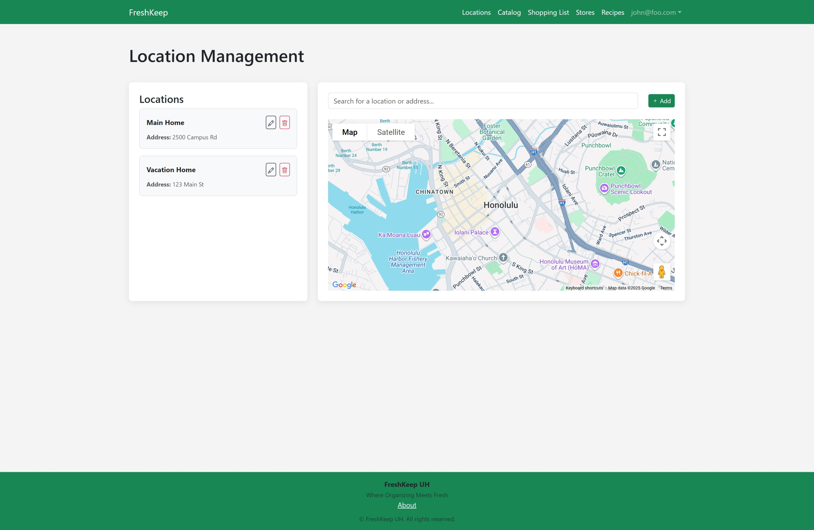
  The Locations page is where you can manage your home and other locations where you live or work.

###  Location

  

  The Location page letes you see a single location and all of the storage associated with the location.

#### Location Add/Edit Mode

  

  The Add/Edit mode of the Location page allows you to edit the name, address, etc. of a new or existing location.

## Storage Areas

  

  The Storages page is where you can manage all of your storage.

### Storage Area

  

  The Storage page letes you see a single storage and all of the product instances associated with it.

#### Storage Area Add/Edit Mode

  

  The Add/Edit mode of the Storage page allows you to edit the name, type, etc. of a new or existing storage.

## Products

  

  The Products page is where you can manage all of your products.

### Product

  

  The Product page letes you see a single Product and all of the product instances associated with it.

#### Product Add/Edit Mode

  

  The Add/Edit mode of the Product page allows you to edit the name, type, etc. of a new or existing product.

### Product Instance

  

  The Product Instance page allows you to see the instance of the product.

#### Product Instance Add/Edit Mode

  

  The Add/Edit mode of the Product Instance page allows you to edit the location, storage, etc. of a new or existing product instance.

#### Use Mode

  

  The Use mode of the Product Instance page allows you to edit the Quantity of an existing product instance.

## Recipes

  
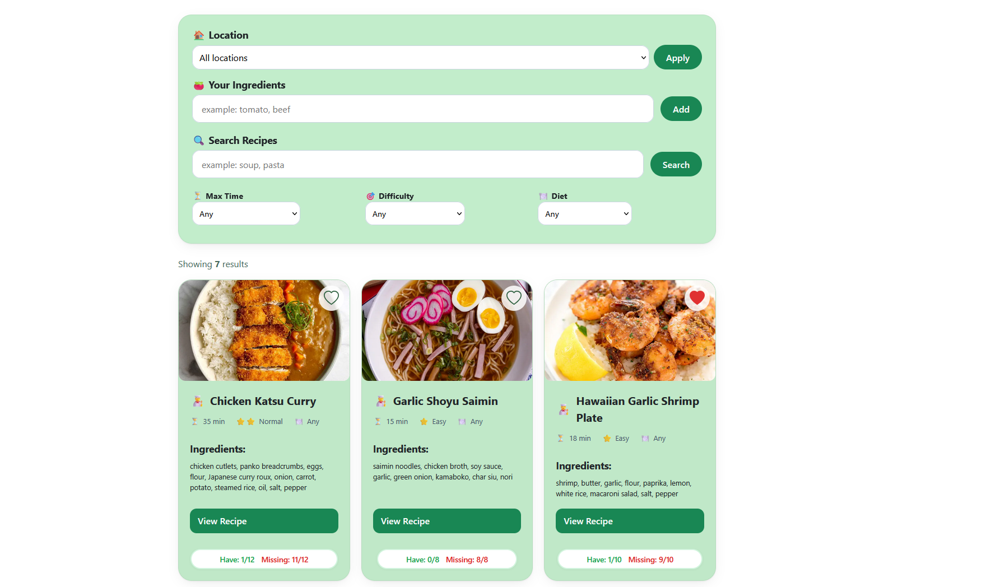
  The Recipe page allows you to see your recipes. Use the filter options to find a particular recipe.

### Recipe

  

  The Recipe page allows you to see the instance of the Recipe.

#### Recipe Add/Edit Mode

  

  The Add/Edit mode of the Recipe page allows you to edit the title, etc. of a new or existing recipe.

## Shopping Lists

  

    The Shopping Lists page allows you to see and manage your shopping lists.

### Shopping List

  
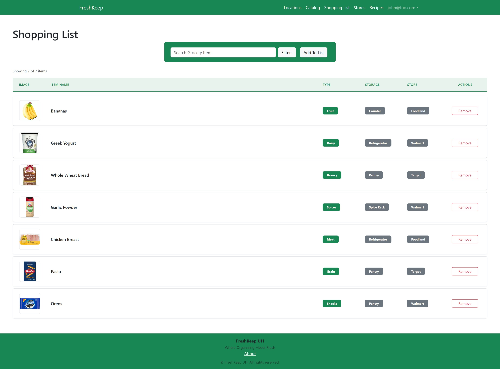
    The Shopping List page allows you to see the individual shopping list and the products associated with it.
  

#### Shopping List Add/Edit Mode

  

    The Add/Edit mode of the Shopping List page allows you to edit the name, etc.
  

## Stores

  
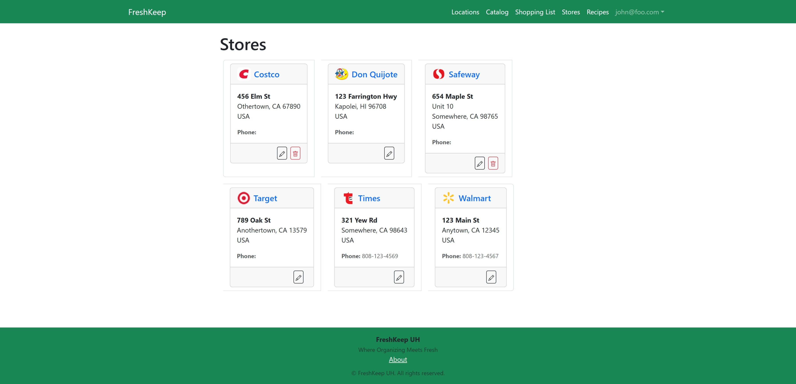
    The Stores page allows you to see the stores at which you shop.
  

  

    
<strong>Buttons</strong>

    <ul>
      <li><strong>Add:</strong>
        The Plus icon pops up a modal dialog where you can add a Store.
        See the <a href="#store-addedit-mode">Store Add/Edit Mode</a> section for details on the available fields and buttons.
      </li>
      <li><strong>Edit:</strong>
        The Pencil icon puts you into <a href="#store-addedit-mode">Edit</a> mode, where you can edit the name, address, etc.
        See the <a href="#store-addedit-mode">Store Add/Edit Mode</a> section for details on the available fields and buttons.
      </li>
      <li><strong>Delete:</strong>
        The Trash Can icon deletes the store, and is only enabled if the Store has no Shopping Lists or Products associated with it.
      </li>
    </ul>
    
<strong>Links</strong>

    <ul>
      <li><strong>Store Logo:</strong> Go to the Store&apos;s Webpage, if known.</li>
      <li><strong>Store Name:</strong>
        Go to the <a href="#store">Store</a> page, where you can see and edit the Store information, and view the Shopping Lists and Products associated with the Store.
      </li>
    </ul>
  

### Store

  
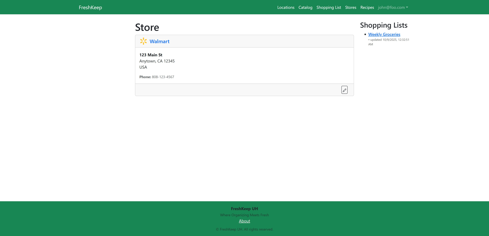
  The Store page allows you to see the particular store, the shopping lists associated with it, and the Products you purchase from that store.

  

    
<strong>Buttons</strong>

    <ul>
      <li><strong>Back:</strong> Go back to the referring page.</li>
      <li><strong>Edit:</strong>
        The Pencil icon puts you into Edit mode, where you can edit the name, address, etc.
        See the <a href="#store-addedit-mode">Store Add/Edit Mode</a> section for details on the available fields and buttons.
      </li>
      <li><strong>Delete:</strong>
        The Trash Can icon deletes the store, and is only enabled if the Store has no Shopping Lists or Products associated with it.
      </li>
    </ul>
    
<strong>Links</strong>

    <ul>
      <li><strong>Store Logo:</strong> Go to the Store&apos;s Webpage, if known.</li>
      <li><strong>Shopping List Name:</strong>
        Go to the <a href="#shopping-list">Shopping List</a> page, where you can see and edit the Shopping List information, and view the Products associated with that List.
      </li>
      <li><strong>Product Name:</strong>
        Go to the <a href="#product">Product</a> page, where you can see and edit the Product information, and view the Instances associated with that Product.
      </li>
    </ul>
  

#### Store Add/Edit Mode

  
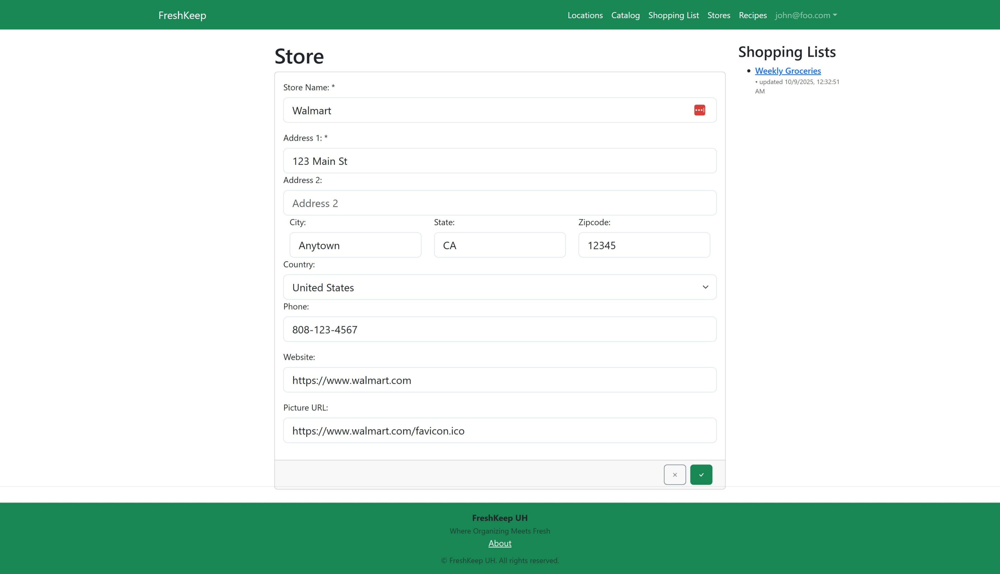
  The Add/Edit mode of the Store page allows you to edit the name, address, etc.

  

    
<strong>Fields</strong>

    <ul>
      <li><strong>Name:</strong> Enter the name of the store, required, must be unique.</li>
      <li><strong>Address 1:</strong> Enter the street address of the store, required.</li>
      <li><strong>Address 2:</strong> Enter the secondary address of the store such as a Suite number, optional.</li>
      <li><strong>City:</strong> Enter the City in which the store is located, required.</li>
      <li><strong>State:</strong> Enter the State or Provence in which the store is located, required.</li>
      <li><strong>ZIP Code:</strong> Enter the ZIP or Postal Code in which the store is located, required.</li>
      <li><strong>Country:</strong> Select the Country in which the store is located, required.</li>
      <li><strong>Phone:</strong> Enter the Phone number of the store, optional.</li>
      <li><strong>Website:</strong> Enter the Website URL for the store, optional.</li>
      <li><strong>Picture:</strong> Upload an image to be used as the Store logo from a website URL or your computer.</li>
    </ul>
    
<strong>Buttons</strong>

    <ul>
      <li><strong>Cancel:</strong> The X icon will cancel your changes, and return you to <a href="#store">View</a> mode.</li>
      <li><strong>Save:</strong> The Check icon will save your changes, and return you to <a href="#store">View</a> mode.</li>
    </ul>
    
<strong>Links</strong>

    <ul>
      <li><strong>Shopping List Name:</strong> Go to the <a href="#shopping-list">Shopping List</a> page, where you can see and edit the Shopping List information, and view the Products associated with that List. Clicking these links while in edit mode will cancel your changes.</li>
      <li><strong>Product Name:</strong> Go to the <a href="#product">Product</a> page, where you can see and edit the Product information, and view the Instances associated with that Product. Clicking these links while in edit mode will cancel your changes.</li>
    </ul>
  

## Settings

  
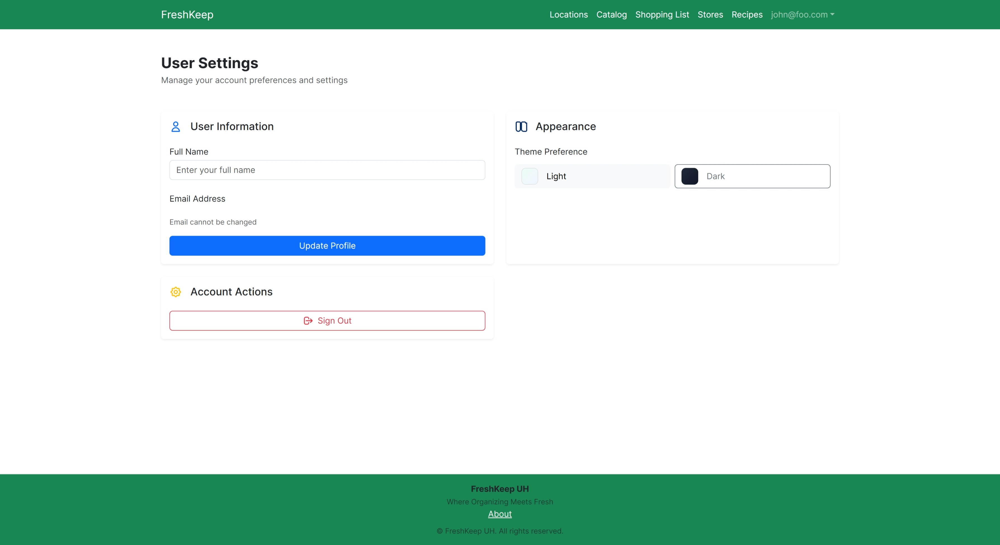
  The settings page allows you to customize your avatar, set your first and last name, update your email address, and select the light or dark theme. You can also set the threshold for expiring soon in days, which defaults to three (3).

## Users

TBD

### User

TBD

#### User Add/Edit Mode

TBD

## Reports

### Inventory

  

    Shows all items in inventory sorted and grouped by location, storage area, and product name.
    Clicking on a location, storage area, or product will take you to the associated page.
  

  
<strong>Filter Options</strong>

  <ul>
    <li><strong>Location:</strong> Select a location.</li>
    <li><strong>Storage Type:</strong> Select a Storage Type.</li>
    <li><strong>Storage Area:</strong> Select a Storage Area.</li>
    <li><strong>Product:</strong> Select a Product.</li>
  </ul>
  
<strong>Columns</strong>

  <ul>
    <li><strong>Location:</strong> The location in which the Product that is needed is stored.</li>
    <li><strong>Storage Area:</strong> The storage area in which the Product that is needed is stored.</li>
    <li><strong>Product:</strong> The Product that is expiring soon.</li>
    <li><strong>Quantity:</strong> The quantity of the Product that is expiring soon.</li>
    <li><strong>Unit of Measure:</strong> The unit of measure for the quantity of the Product that is expiring soon.</li>
  </ul>

### Expired

  

    Shows all items in inventory that are expired sorted and grouped by location, storage area, product name, and expiration date.
    Clicking on a location, storage area, or product will take you to the associated page.
  

  
<strong>Filter Options</strong>

  <ul>
    <li><strong>Location:</strong> Select a location.</li>
    <li><strong>Storage Type:</strong> Select a Storage Type.</li>
    <li><strong>Storage Area:</strong> Select a Storage Area.</li>
    <li><strong>Product:</strong> Select a Product.</li>
  </ul>
  
<strong>Columns</strong>

  <ul>
    <li><strong>Location:</strong> The location in which the Product that is needed is stored.</li>
    <li><strong>Storage Area:</strong> The storage area in which the Product that is needed is stored.</li>
    <li><strong>Product:</strong> The Product that is expiring soon.</li>
    <li><strong>Expiration Date:</strong> The expiration date of the Product that is expiring soon.</li>
    <li><strong>Quantity:</strong> The quantity of the Product that is expiring soon.</li>
    <li><strong>Unit of Measure:</strong> The unit of measure for the quantity of the Product that is expiring soon.</li>
  </ul>

### Expiring

  

    Shows all items in inventory that are expiring soon sorted and grouped by location, storage area, product name, and expiration date.
    Clicking on a location, storage area, or product will take you to the associated page.
  

  
<strong>Filter Options</strong>

  <ul>
    <li><strong>Location:</strong> Select a location.</li>
    <li><strong>Storage Type:</strong> Select a Storage Type.</li>
    <li><strong>Storage Area:</strong> Select a Storage Area.</li>
    <li><strong>Product:</strong> Select a Product.</li>
    <li><strong>Threshold:</strong>
      The number of days use when calculating if an item is expiring soon.
      Defaults to the value given on the <a href="#settings">Settings</a> page.
    </li>
  </ul>
  
<strong>Columns</strong>

  <ul>
    <li><strong>Location:</strong> The location in which the Product that is needed is stored.</li>
    <li><strong>Storage Area:</strong> The storage area in which the Product that is needed is stored.</li>
    <li><strong>Product:</strong> The Product that is expiring soon.</li>
    <li><strong>Expiration Date:</strong> The expiration date of the Product that is expiring soon.</li>
    <li><strong>Quantity:</strong> The quantity of the Product that is expiring soon.</li>
    <li><strong>Unit of Measure:</strong> The unit of measure for the quantity of the Product that is expiring soon.</li>
  </ul>

### Restock

  

    Shows all products that are marked as 'Needed' sorted and grouped by location, storage area, and product name.
    Clicking on a location, storage area, or product will take you to the associated page.
  

  
<strong>Filter Options</strong>

  <ul>
    <li><strong>Location:</strong> Select a location.</li>
    <li><strong>Storage Type:</strong> Select a Storage Type.</li>
    <li><strong>Storage Area:</strong> Select a Storage Area.</li>
    <li><strong>Product:</strong> Select a Product.</li>
  </ul>
  
<strong>Columns</strong>

  <ul>
    <li><strong>Location:</strong> The location in which the Product that is needed is stored.</li>
    <li><strong>Storage Area:</strong> The storage area in which the Product that is needed is stored.</li>
    <li><strong>Product:</strong> The Product that is needed.</li>
    <li><strong>Quantity:</strong> The quantity of the Product currently on hand.</li>
    <li><strong>Unit of Measure:</strong> The unit of measure for the quantity of the Product currently on hand.</li>
  </ul>

