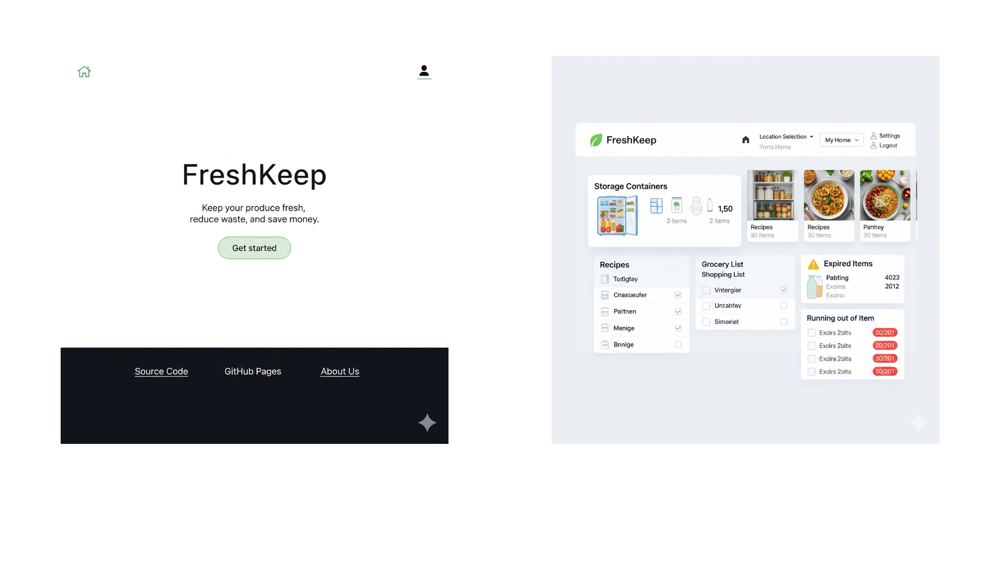
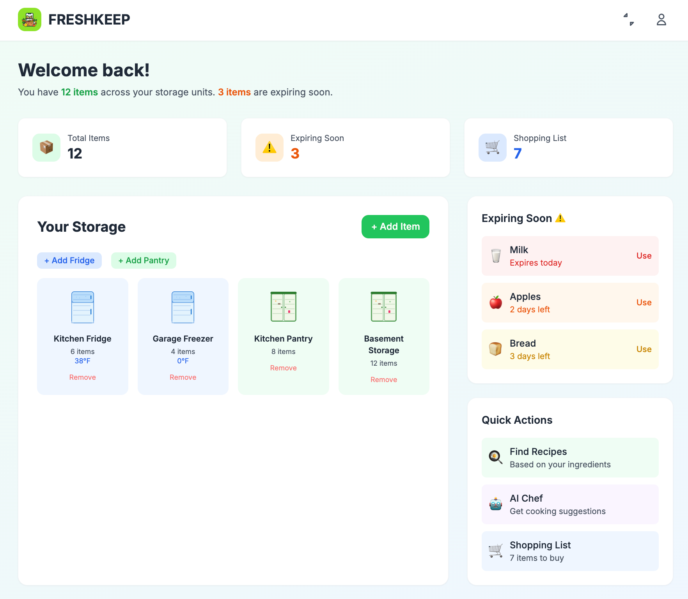
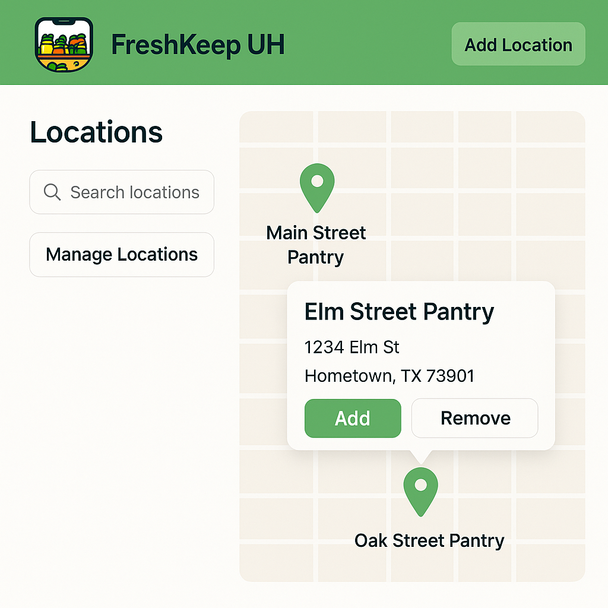
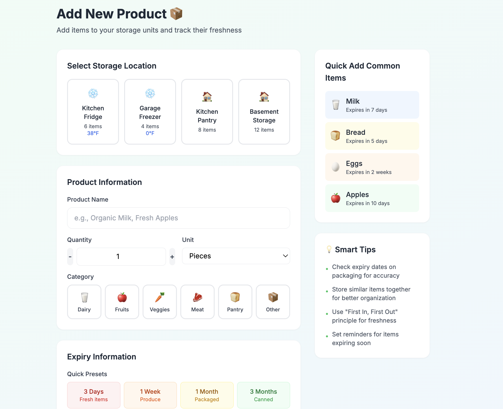
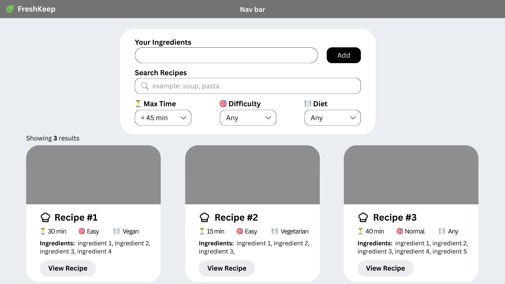

# How to Use FreshKeep

## Home Page

  

## Sign Up

  

## Sign In

  

## Forgot Password

## Settings

  

## Dashboard

  

## Locations

  

###  Location

#### Add/Edit Mode

  

#### Remove

## Storage Containers

### Storage Container

#### Add/Edit Mode

#### Remove

## Items

### Item

#### Add/Edit Mode

  

#### Use Mode

#### Restock Mode

#### Remove

## Recipes

### Recipe

  

#### Add/Edit Mode

#### Remove

## Reports

### Inventory

### Expired

### Expiring

### Restock

